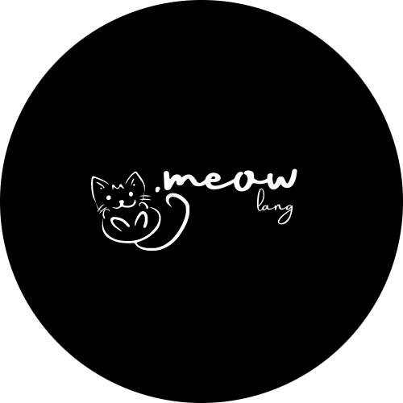

<h2 align="center">
  <br>
    
  <br><br>
  The Meow Language
  <br><br>
</h2>

### Build instructions

```
git clone <repo>
cd <repo>

javac -d ./target/classes ./src/*.java
cd ./target/classes
java src.Shell
```

### Thanks

This project is based on a [video series](https://youtube.com/playlist?list=PLZQftyCk7_SdoVexSmwy_tBgs7P0b97yD) by [@davidcallanan](https://github.com/davidcallanan/). 

Special thanks to [@thearcodas](https://github.com/thearcodas/) for making this adorable logo.
